# Laporan Resmi Modul 1
Repository ini dibuat sebagai laporan resmi untuk pengerjaan [Soal Shift Modul 1](https://docs.google.com/document/d/1e5fXdleV59vFthVeK0O5WfmuOYV6xi6WkpHsZEiBofE/edit) dari praktikum Mata Kuliah Komunikasi Data dan Jaringan Komputer.

Repository ini dibuat oleh:  

**Kelompok ITB06**
- Sarah Hanifah Pontoh	5027201006
- Sharira Saniane 	5027201016
- Naufal Dhiya Ulhaq 	5027201029

## Table of Contents

## Files
Pada soal shift ini, kami diberikan tiga buah file yaitu:  
[soal1-2.pcapng](https://drive.google.com/file/d/1ys_8z-ggXnAFC9Pztaw_2MDpf1QfKUZX/view?usp=sharing)    
[soal3-6.pcapng](https://drive.google.com/file/d/1T-8AzH97Z6xmWpKk7ptwIIIOzWnXq6ij/view?usp=sharing)  
[soal8-10.pcapng](https://drive.google.com/file/d/1auVHDMKHhpbDLwRyN_cmPW7x4sL-a_fy/view?usp=sharing)  

Dengan file-file tersebut, kami diberikan beberapa soal:

## Soal 1
Sebutkan web server yang digunakan pada "monta.if.its.ac.id"!  
  
Langkah-langkah : 
1. Memasukkan Filter : `http.host==monta.if.its.ac.id`

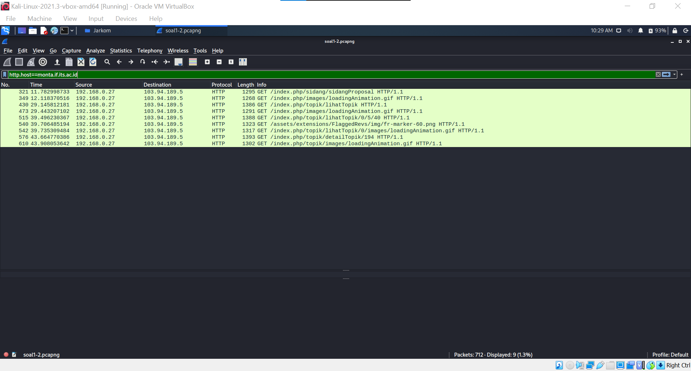

2. Follow salah satu paket yang dikirimkan.

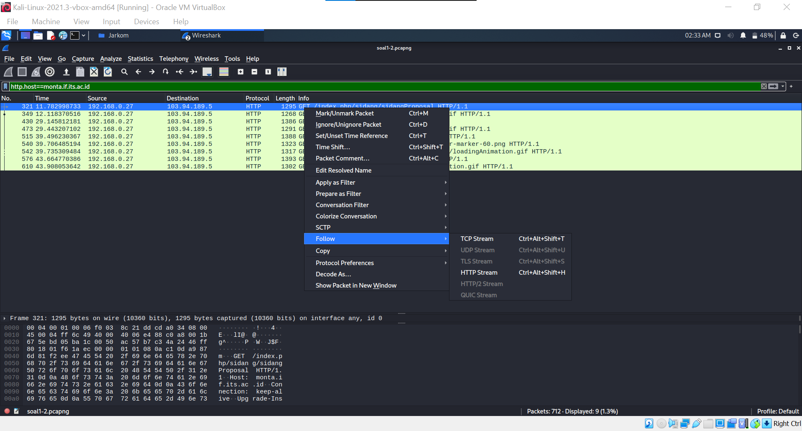

3. Pada paket yang sudah difollow, kita dapat mencari web server yang digunakan pada "monta.if.its.ac.id" yaitu : `nginx/1.10.3`.

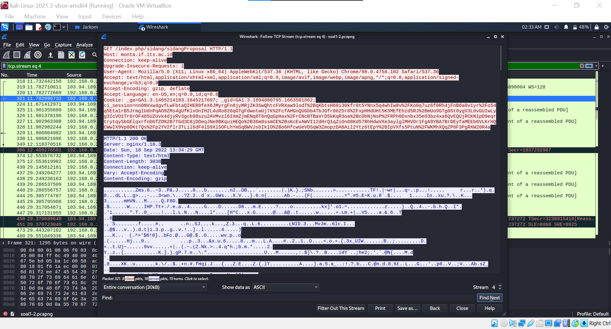

## Soal 2
Ishaq sedang bingung mencari topik ta untuk semester ini , lalu ia datang ke website monta dan menemukan detail topik pada website “monta.if.its.ac.id” , judul TA apa yang dibuka oleh ishaq ?  

Langkah-langkah : 
1. Memasukkan Filter : `http.host==monta.if.its.ac.id`
2. Klik paket http yang terdapat `detailTopik` pada URI nya.
3. Cek Full Request URI dari paket tersebut.

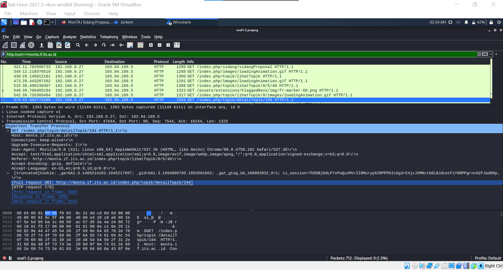

3. Dari URI yang didapatkan, kita dapat mengakses page pada sebuah website. Dari page tersebut, kita dapat menemukan judul TA yang dibuka oleh ishaq adalah: `Evaluasi unjuk kerja User Space Filesystem (FUSE)`.

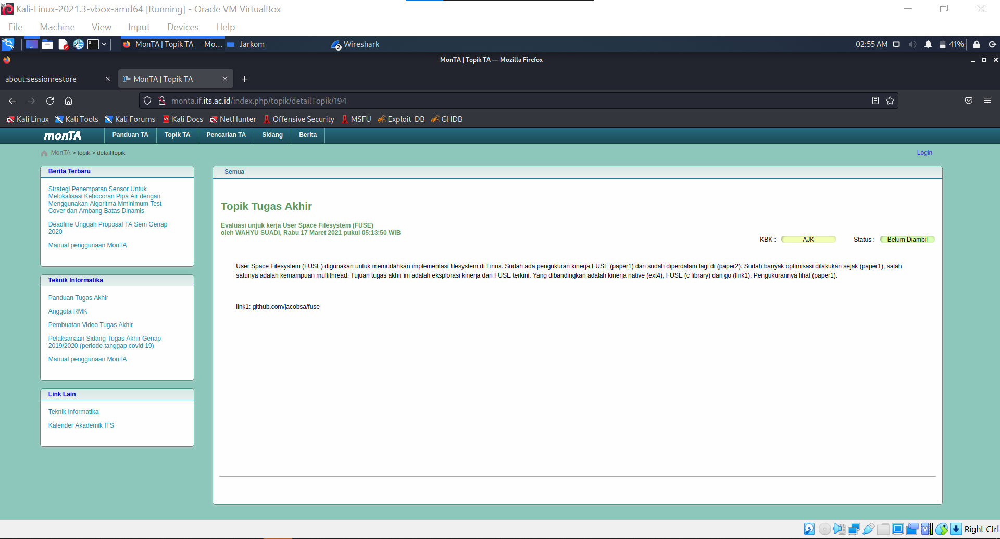

## Soal 3
Filter sehingga wireshark hanya menampilkan paket yang menuju port 80!  

Langkah-langkah :  
1. Membuka file [soal3-6.pcapng](https://drive.google.com/file/d/1T-8AzH97Z6xmWpKk7ptwIIIOzWnXq6ij/view?usp=sharing).
2. Memasukkan filter : `tcp.dstport == 80 || udp.dstport==80`

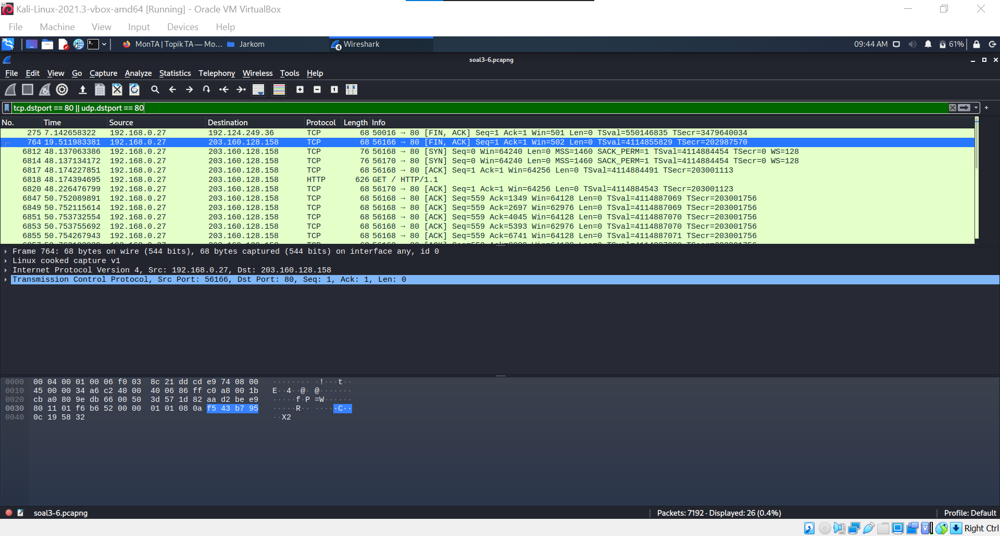

## Soal 4
Filter sehingga wireshark hanya mengambil paket yang berasal dari port 21!  

Langkah-langkah : 
1. Membuka file [soal3-6.pcapng](https://drive.google.com/file/d/1T-8AzH97Z6xmWpKk7ptwIIIOzWnXq6ij/view?usp=sharing).
2. Memasukkan filter: `tcp.dstport == 21 || udp.dstport==21`

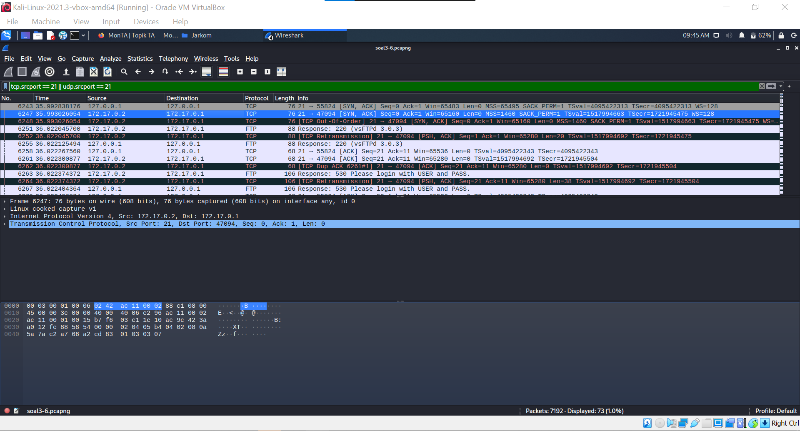

## Soal 5
Filter sehingga wireshark hanya mengambil paket yang berasal dari port 443!  

Langkah-langkah : 
1. Membuka file [soal3-6.pcapng](https://drive.google.com/file/d/1T-8AzH97Z6xmWpKk7ptwIIIOzWnXq6ij/view?usp=sharing).
2. Memasukkan filter :  `tcp.dstport == 443 || udp.dstport == 443`

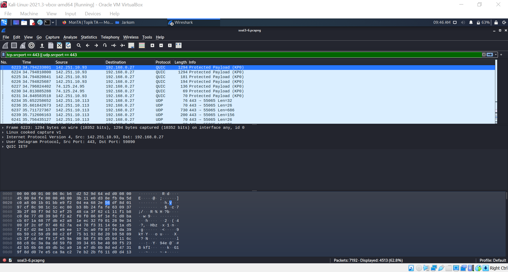

## Soal 6
Filter sehingga wireshark hanya menampilkan paket yang menuju ke lipi.go.id!  

Langkah-langkah : 
1. Membuka file [soal3-6.pcapng](https://drive.google.com/file/d/1T-8AzH97Z6xmWpKk7ptwIIIOzWnXq6ij/view?usp=sharing).
2.  Memasukkan filter :  `http.host == lipi.go.id`

## Soal 7
Filter sehingga wireshark hanya mengambil paket yang berasal dari ip kalian!

Langkah-langkah : 
1. Cek ip dengan menggunakan ifconfig pada terminal. Pada mesin kami, ip adress nya adalah `10.0.2.15`

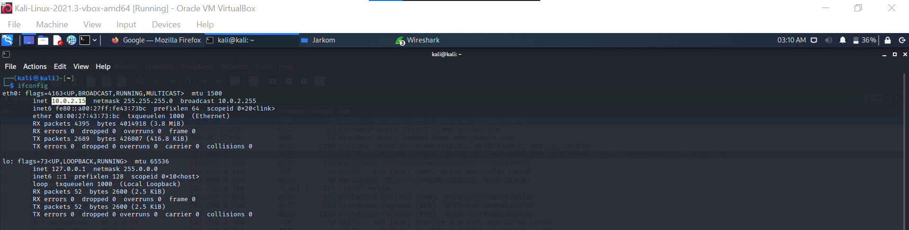

2. Memasukkan filter sesuai dengan ip dari mesin : `ip.src == 10.0.2.15`

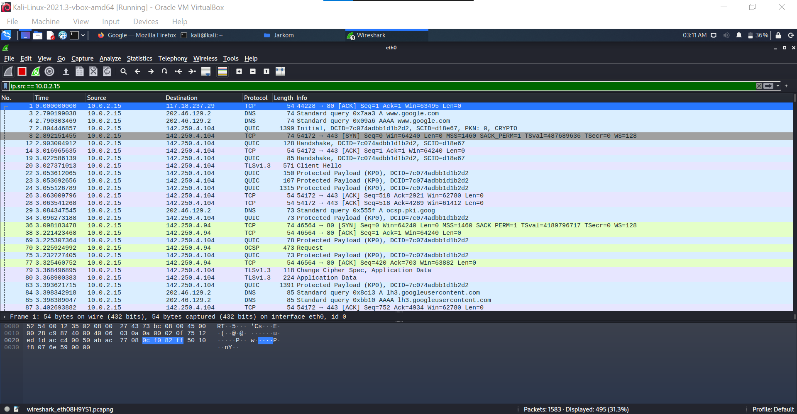

## Soal 8
Telusuri aliran paket dalam file .pcap yang diberikan, cari informasi berguna berupa percakapan antara dua mahasiswa terkait tindakan kecurangan pada kegiatan praktikum. Percakapan tersebut dilaporkan menggunakan protokol jaringan dengan tingkat keandalan yang tinggi dalam pertukaran datanya sehingga kalian perlu menerapkan filter dengan protokol yang tersebut.  

Langkah-langkah:
1. Membuka file [soal3-6.pcapng](https://drive.google.com/file/d/1T-8AzH97Z6xmWpKk7ptwIIIOzWnXq6ij/view?usp=sharing).
2. Memasukkan filter : `tcp.strean`

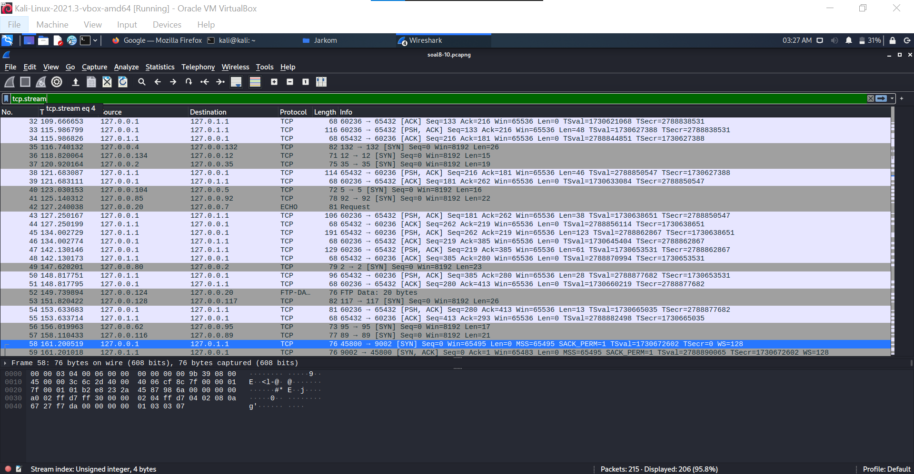

3. Follow salah satu paket hingga menemukan percakapan.

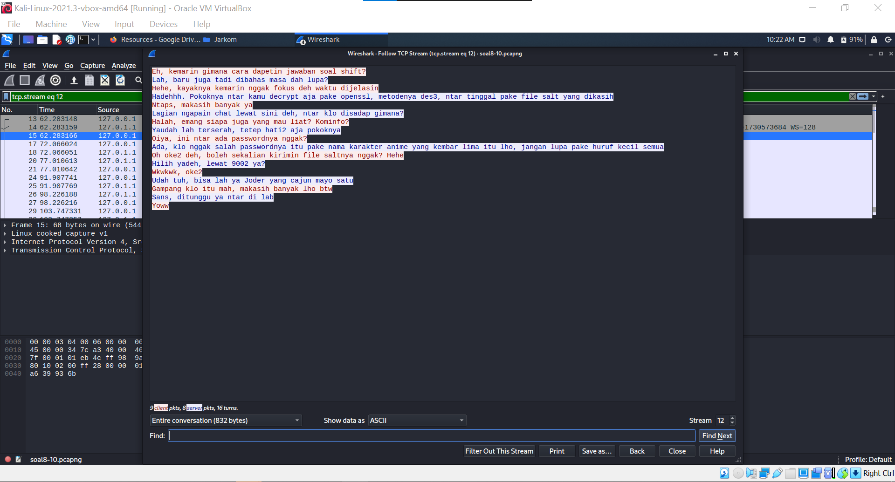

4. Dari hasil pemeriksaan, terdapat tiga percakapan yang dapat kita dapatkan sebagai berikut:
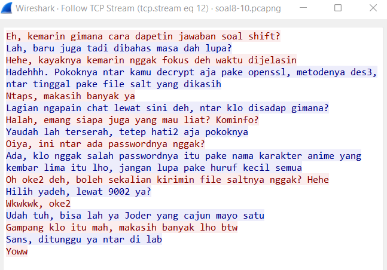
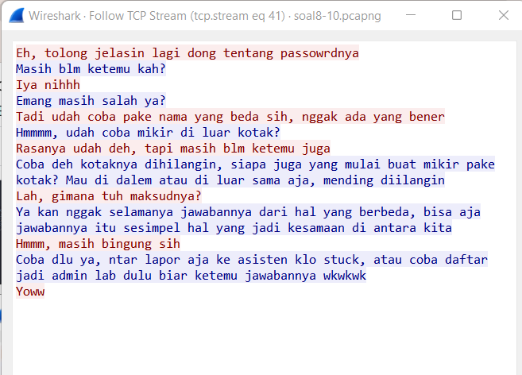
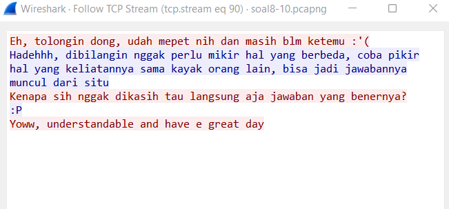

## Soal 9
Terdapat laporan adanya pertukaran file yang dilakukan oleh kedua mahasiswa dalam percakapan yang diperoleh, carilah file yang dimaksud! Untuk memudahkan laporan kepada atasan, beri nama file yang ditemukan dengan format [nama_kelompok].des3 dan simpan output file dengan nama “flag.txt”.

Langkah-langkah:
1. Sesuai dengan clue pada percakapan pertama, file rahasia tersebut dikirimkan melalui port 9002. Maka kita akan memnaruh filter pada wireshark sebagai berikut: `tcp.port == 9002`

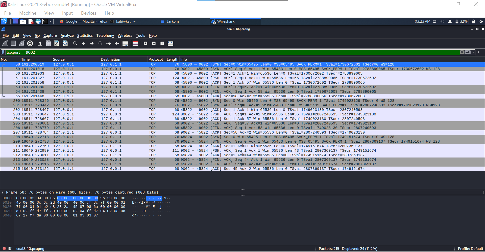

3. Dari hasil filter tersebut, kita dapat mendapatkan sebuah paket yang berisi salted file. Simpan salted file tersebut sesuai dengan perintah soal. Dalam konteks ini, kami menyimpannya dengan nama `ITB06.des3` (Jangan lupa untuk menyimpannya sebagai raw).

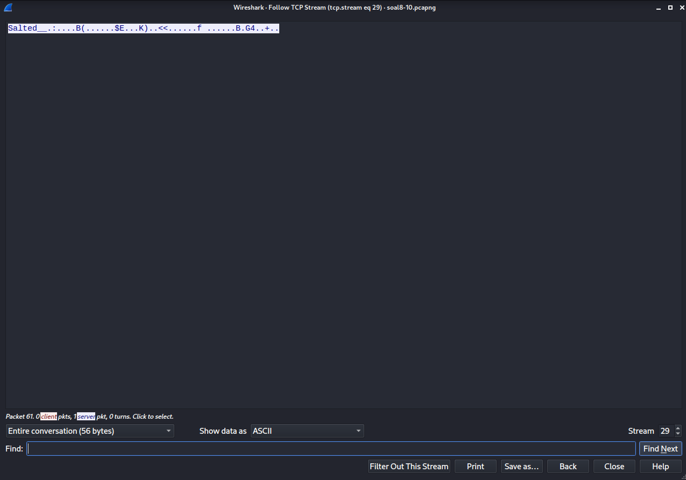

5. Dari percakapan kedua, kita juga mendapatkan clue bahwa file salted dapat didekripsi dengan menggunakan tools openssl. Dengan menggunakan tools tersebut, kami mendapatkan output yang kami beri nama `flag.txt`.

## Soal 10
Temukan password rahasia (flag) dari organisasi bawah tanah yang disebutkan di atas!

Langkah-langkah:
1. Buka file output dekripsi dari file salted sebelumnya.

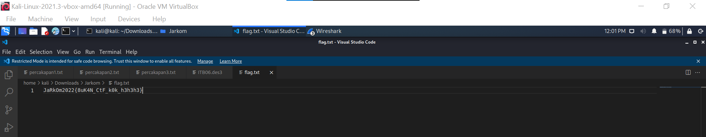

2. Dari file tersebut, kita mendapatkan sebuah flag yaitu : `JaRkOm2022{8uK4N_CtF_k0k_h3h3h3}`
